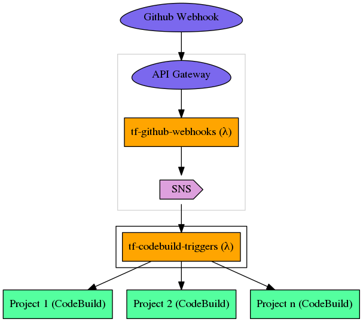

# tf-codebuild-trigger
a `node.js` lambda function that trigger `AWS Codebuild` project builds using `Github` event payloads delivered via `SNS`

<p align="center">

</p>

## Installing
```shell
# clone the repo and install dependencies
$ git clone git@github.com:cludden/tf-codebuild-trigger.git
```

## Contributing
1. Clone it (`git clone git@github.com:cludden/tf-codebuild-trigger.git`)
1. Create your feature branch (`git checkout -b my-new-feature`)
1. Commit your changes using [conventional changelog standards](https://github.com/bcoe/conventional-changelog-standard/blob/master/convention.md) (`git commit -m 'feat(my-new-feature): Add some feature'`)
1. Push to the branch (`git push origin my-new-feature`)
1. Ensure linting/security/tests are all passing
1. Create new Pull Request

## Testing
Prerequisites:
- [Docker & Compose](https://store.docker.com/search?offering=community&type=edition))

```shell
# run test suite and generate code coverage
$ docker-compose run tf-codebuild-trigger

# run linter
$ docker-compose run tf-codebuild-trigger npm run lint

# run security scan
$ docker-compose run tf-codebuild-trigger npm run sec
```

## Building
```
$ docker-compose run tf-codebuild-trigger
```

## Releasing
1. Merge fixes & features to master
1. Run lint check `npm run lint`
1. Run security check `npm run sec`
1. Run full test suite `docker-compose run tf-codebuild-trigger`
1. Run release script `npm run release`
1. Push release & release tag to github `git push --follow-tags`
1. [Publish new release](https://help.github.com/articles/creating-releases/) in github, using the release notes from the [CHANGELOG](./CHANGELOG)

## Configuring
Define custom configuration
```json
{
  "github": {
    "buildspecs": {
      "buildspec.pr.yml": {
        "type": "object",
        "properties": {
          "eventName": {
            "const": "pull_request"
          },
          "action": {
            "type": "string",
            "enum": [
              "opened",
              "edited",
              "reopened"
            ]
          }
        },
        "required": [
          "eventName",
          "action"
        ]
      },
      "buildspec.release.yml": {
        "type": "object",
        "properties": {
          "eventName": {
            "const": "release"
          },
          "action": {
            "type": "string",
            "enum": [
              "published"
            ]
          }
        },
        "required": [
          "eventName",
          "action"
        ]
      }
    }
  },
  "log": {
    "level": "info"
  }
}
```

Add JSON configuration to ssm
```shell
$ aws ssm put-parameter --name /secrets/codebuild-trigger/custom --type SecureString --value $JSONCONFIG
```
## Deploying
Via terraform
```
module "codebuild_trigger" {
  source                     = "git::git@github.com:cludden/tf-codebuild-trigger.git//terraform?ref={version}"
  additional_parameter_names = "/secrets/codebuild-trigger/custom"
  config_parameter_name      = "/secrets/codebuild-trigger"
  debug                      = ""
  memory_size                = 128
  name                       = "codebuild-trigger"
  node_env                   = "production"
  region                     = "us-west-2"
  s3_bucket                  = "my-artifact-bucet"
  s3_key                     = "tf-codebuild-trigger/${var.version}/index.zip"
  sns_topic_arn              = "${var.sns_topic_arn}"
  timeout                    = 10
}
```

## License
Licensed under the [MIT License](LICENSE.md)

Copyright (c) 2017 Chris Ludden
